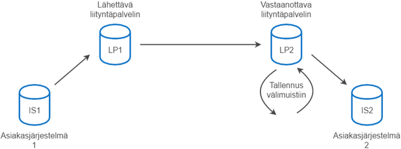
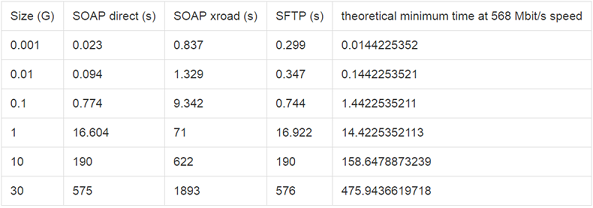

layout: true
name: sininen-palkki
class: sininen-palkki

---
layout: true
name: valkoinen
class: valkoinen

---
layout: true
name: header
class: center, middle, sininen

<!--DON'T TOUCH ABOVE THIS !!!!!! -->
---

template: header
# Suomi.fi-palveluväylä
.center[Liityntäpalvelimen suorituskyky]

---

template: sininen-palkki

# Liityntäpalvelimen suorityskyky
Liityntäpalvelimen suorituskykyä seurataan jatkuvasti ja toimintaa pyritään jatkuvasti parantamaan ja suorituskykyä lisäämään.

- Liityntäpalvelimen suorituskyky riippuu useasta tekijästä:
    + **_merkittävästi_** alustapalvelimen kapasiteetista (keskusmuistista, suorittimesta, suorittimien määrästä, kovalevyn nopeudesta jne.) 
        * Lue lisää: [Liityntäpalvelimen tekniset vaatimukset](https://esuomi.fi/palveluntarjoajille/palveluvayla/tekninen-aineisto/hyva-tietaa/liityntapalvelimen-tekniset-vaatimukset/)
    + **_merkittävästi_** käytetystä liityntäpalvelimen ohjelmistoversiosta (uusimmat tehokkaimpia)
    + **_merkittävästi_** yhtäaikaisten palvelukutsujen määrästä
    + **_merkittävästi_** väylässä välitettävien viestien (palvelukutsut ja –vastaukset) sanomakoosta. Isot sanomat vaatii enemmän prosessointia.
    + **_paljon_** käytetyistä muistiasetuksista
        * Säädä oman liityntäpalvelimen muistiasetukset!
            - [Liityntäpalvelimen suositellut muistiasetukset](https://esuomi.fi/palveluntarjoajille/palveluvayla/tekninen-aineisto/hyva-tietaa/liityntapalvelimen-suositellut-muistiasetukset/)

---

template: sininen-palkki

# Liityntäpalvelimen suorityskyky (jatkoa)

- Liityntäpalvelimen suorituskyky riippuu useasta tekijästä:
    + **_merkittävästi_** ulkoisen kuormantasaajan käyttämisestä (kts. oma osa-alueensa koulutuspaketissa)
    + **_paljon_** käytetystä verkosta (verkon nopeudesta)
    + (_enemmän tai vähemmän_) liitetyn asiakasjärjestelmän palvelun toteutuksesta ja/tai verkkoinfrasta

---

template: sininen-palkki

# Suorituskykytestaukset

- Jokainen liityntäpalvelimen ohjelmistoversio suorituskyky testataan moneen kertaan.
    + Kahdet eri suorituskykytestit (kahdella erilaisella alustaympäristöllä):
        * Minimikokoonpano (1 x cpu, 4G keskusmuisti, 7G levy)
        * Raskas tuotantokäyttö (8 x cpu, 16G keskusmuisti, 250G levy
    + Saatuja tuloksia seurataan systemaattisesti
    + Suorituskykytestauksen periaate:
        * Testataan sanomakoot 100B – 10M 
        * Testin alussa 1 palvelukutsu, palvelukutsujen määrää lisätään testin aikana niin, että testin lopussa on 100…250 yhtäaikaista kutsua kullakin sanomakoolla (määrä riippuu sanomakoosta)
        * Läpi menneet sanomamäärät ja niiden vasteajat mitataan
    + Kehitystiimi testaa lisäksi jatkuvasti omassa CI-ympäristössä suorituskykyä

---

template: sininen-palkki

# Mittaustuloksia

- Eri ohjelmistoversioiden suorituskykyvertailu eri sanomakooilla (90% fraktiili, millisekuntia)
.center[]

---

template: sininen-palkki

# Isojen tiedostojen siirto palveluväylässä

- Periaate:
.center[]
- Lähettävä liityntäpalvelin striimaa lähettävän tiedoston
- Isojen tiedostojen siirto (= 10M) suositellaan tehtäväksi palveluväylän yli ns. liitetiedostoina
- Liityntäpalvelimen CPU ja käytetyn levyn nopeus ratkaisee merkittävästi suorituskyvyn
- Lue lisää: [Suurten liitetiedostojen siirtäminen palveluväylässä](https://esuomi.fi/palveluntarjoajille/palveluvayla/tekninen-aineisto/hyva-tietaa/suurten-liitetiedostojen-siirtaminen-palveluvaylassa/)  

---

template: sininen-palkki

# Isot tiedostot, suorituskyky

- Mittaustuloksia isojen tiedostojen siirrosta palveluväylässä ja ilman väylää:
.center[]
Yllä esiintyvät termit:
    - SOAP direct: suora palvelukutsu tietojärjestelmien välillä (palveluväylän liityntäpalvelimet eivät osallistu viestin välitykseen)
    - SOAP xroad: testipalvelua käytetään palveluväylän kautta (ns. normaali tapa käyttää palveluväylää)
    - SFTP: siirretään tiedosto SFTP:llä
    - 568 Mbit/s: laskennallinen siirtoaika verkon maksiminopeudella 

---

template: sininen-palkki

# Esimerkki case mitoituksesta

Olemassa olevan järjestelmän tiedonsiirron lähtötiedot:
- Ilmoituksia nykyisin vuositasolla n. 60 000 000 (=60M)
    + Reilu puolet painottuu tammi-helmikuun ajalle (~36M)
    - Tulevaisuudessa järjestelmän tulisi pystyä käsittelemään 145 000 000 (145M) ilmoitusta
        + Oletus: tammi-helmikuun ajalle reilu puolet (60%) ilmoituksista => 87 000 000 (=87M)

- Lasketaan näiden tietojen pohjalta miten palveluväylän suorituskyky mahdollistaa tietojen siirroon. Oletetaan, että ilmoituksen tiedonsiirtoon käytetään yhtä 500k sanomaa (esim. veroilmoituksen lomake).

---

template: sininen-palkki

# Esimerkki case (jatkoa)

Lasketaan worst case skenaariolla:
- Oletus: tammi-helmikuussa 87M ilmoitusta (60% kaikista vuoden ilmoituksista)
    + => Päivässä (2kk=60pv) ilmoituksia: 87M/60pv = 1,45M
    + => Tunnissa ilmoituksia: 1,45M/24h =  0,0604166666666667M (~60500)
    + => Minuutissa ilmoituksia: 60500/ 60 = 1008,333333333333 (~1010)

- Lähtökohtaisesti raskas tuotanto liityntäpalvelin ([mitoitusohje](https://esuomi.fi/palveluntarjoajille/palveluvayla/tekninen-aineisto/hyva-tietaa/liityntapalvelimen-tekniset-vaatimukset/)) pystyy käsittelemään 150-250 kyselyä minuutissa (sanomakoot <=500K) suorituskykyisesti.
    + => **_Tarvitaan kuormantasaaja_**, joka jakaa saapuvat palvelukyselyt neljälle (4) liityntäpalvelimelle, jotta haluttu määrä ilmoituksia minuutissa voidaan käsitellä.
    + Ruuhkahuippuja ja toimintavarmuutta lisäämään todennäköisesti kannattanee asentaa yhteensä 5-7 liityntäpalvelinta palvelukutsuja käsittelemään.

---

template: header
# Kysymyksiä?
